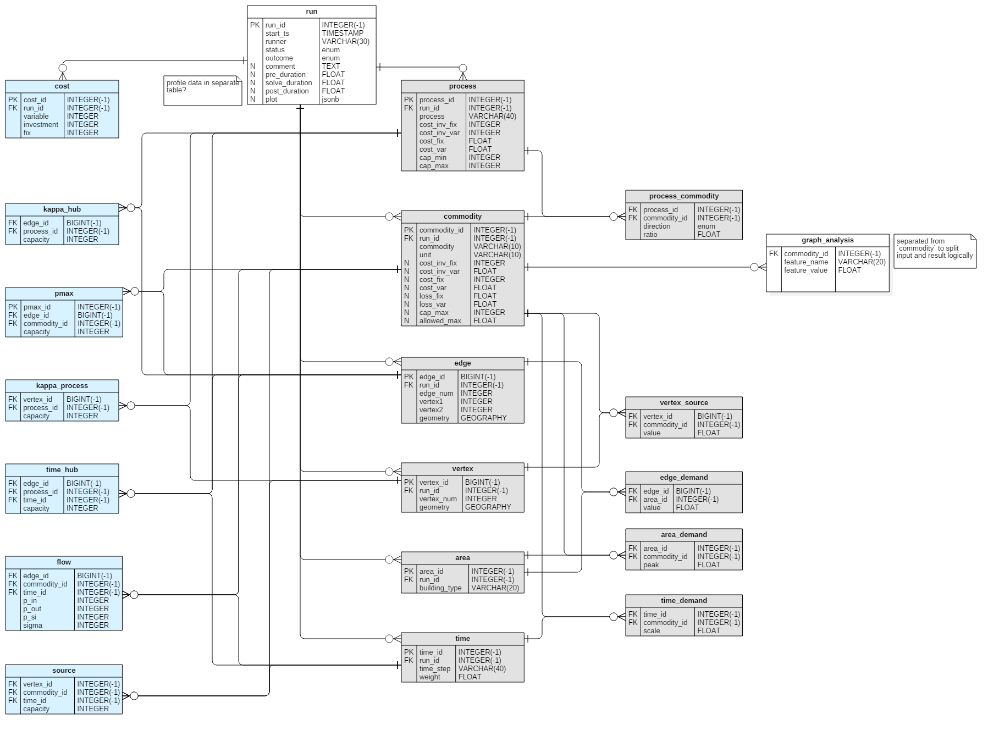

# rivus_db
Postgres database related scripts for [rivus](https://github.com/tum-ens/rivus)

I found that on the long run, and especially if one works with a lot of optimization parameters,
a database (structured, queryable and having general format + API) enables me to do much more with the data.

If you are (very) new to the whole database setup method, you could check out this repo's wiki.
Maybe you can find help for setup and related tasks.

## Entity Relationships (Structure of the database)



The ER is made with [StarUML2](http://staruml.io/) and the base DDL is generated with [Postgres Extension](https://github.com/adrianandrei-ca/staruml-postgresql).
The syntax follows the requirements of [Postgres Extension](https://github.com/adrianandrei-ca/staruml-postgresql):

Special     | Explanation
:------:    | :----------:
INTEGER(-1) | for Postgres data type SERIAL
BIGINT(-1)  | for Postgres data type BIGSERIAL
enum tags   | see description in Postgres Extension


## Creating the database

Using `psql` (if not added to your path, look for it in pg9X/bin).
```
psql -h localhost -U postgres
\i db_create.sql
\connect rivus
\i data_model_table_create.sql
```

### Scripts

The added scripts are postgres specific sql commands. They are generated with [Postgres Extension](https://github.com/adrianandrei-ca/staruml-postgresql) and extended with the extension specific commands.
For small modifications (db name, user, table_space) you can modify it manually otherwise use [StarUML2](http://staruml.io/).

+ `db_create`: Create database named **rivus** for *postgres* in default table_space
+ `db_drop`: Drop database
+ `data_model_table_create`: Create tables and constrains, add PostGIS extension.
+ `data_model_table_drop`: Drop tables, constrains extension in cascade.