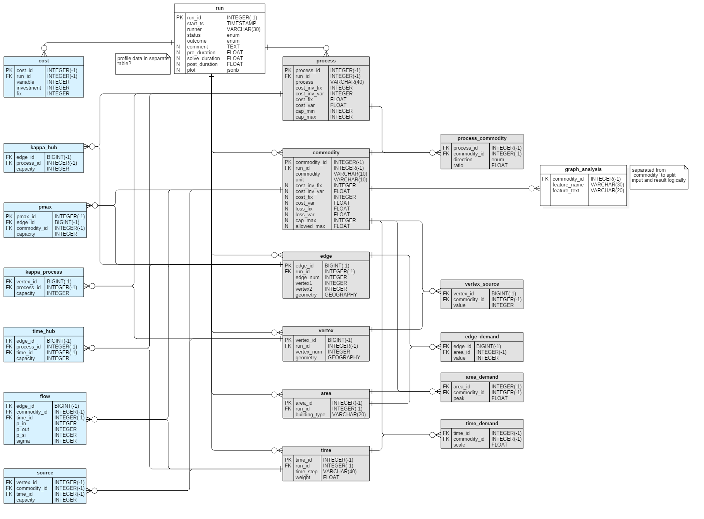

Reference
==========

Entity Relations
-----------------

The structure was created so that it is as flexible as possible regarding dimension changes.
E.g. The number of commodities, demand types etc. are normalized in 3NF.
As such it is no problem (read, you do not need to restructure the database), if at one time there is not 2 but 3 commodity types that are included in the demand per edge DataFrame.
Database structural changes are no friend of ours...

Change in the program part:

+------+----------+------+------+
| Edge | geometry | Heat | Elec |
+======+==========+======+======+
| 0    | LINE     | 150  | 200  |
+------+----------+------+------+

to

+------+----------+------+------+------+
| Edge | geometry | Heat | Elec | Cold |
+======+==========+======+======+======+
| 0    | LINE     | 150  | 200  | 50   |
+------+----------+------+------+------+

Is no problem, as in the DB the edge table is separated from the demand table.
The relation is represented by a table which connects an edge with a commodity.

+---------+-------+----------+
| edge_id | edge  | geometry |
+=========+=======+==========+
| 12345   | 0     | LINE     |
+---------+-------+----------+

is connected to 

+--------------+-----------+
| commodity_id | commodity |
+==============+===========+
| 345          | Heat      |
+--------------+-----------+

through

+----------+--------------+--------+
| edge_id  | commodity_id | demand |
+==========+==============+========+
| 12345    | 345          | 50     |
+----------+--------------+--------+

More on normalization and normal forms `here (simple) <http://www.studytonight.com/dbms/database-normalization.php>`_ 
and `here (detailed) <https://www.sqa.org.uk/e-learning/SoftDevRDS02CD/page_11.htm>`_

The above example shows that storing the DataFrames of the rivus model is often
not a proper solution.

In the following diagram you can see how the data is organised inside the database.
Besides the names, you can retrieve the respective data types too.

	Note: Some type notation follow the syntax of the `PSQL plug-in`_

.. _PSQL plug-in: https://github.com/adrianandrei-ca/staruml-postgresql

+---------------+-----------------------------------------+
| Special       | Explanation                             |
+===============+=========================================+
| INTEGER(-1)   | for Postgres data type SERIAL           |
+---------------+-----------------------------------------+
| BIGINT(-1)    | for Postgres data type BIGSERIAL        |
+---------------+-----------------------------------------+
| enum tags     | see description in Postgres Extension   |
+---------------+-----------------------------------------+

Blue:
	Optimization results
Gray:
	Input (spatial and non-spatial)
White:
	Global and extensions.

Enumerated values
------------------

The following columns accept only the listed values (Case Sensitive.)
Notation: ``table.columns``

``run.status``:
	+ prepared
	+ run
	+ error
``run.outcome``:
	+ optimum,
	+ optimum_not_found
	+ error
	+ not_run
``process_commodity.direction``:
	+ in
	+ out

Scripts - Make Your Life Easier
--------------------------------

.. _scripts-anchor:

Short summary of the used scripts. These scripts are shot and rich with in-line
documentation. So for detail open them up with a text editor.

:file:`rivus_db/sql/create_from_staruml.sh`:
	1. copies the raw scripts from :file:`rivus_db/sql/staruml_expor/` into :file:`rivus_db/sql/` and modifies them slightly

		+ add extension handling
		+ drop some generated defaults (encoding)
		+ your future feature?

	2. executes the modified `create_*.sql` scripts.
	3. if executed with ``extend`` argument: ``create_from_staruml.sh extend`` the 2. step is omitted. (The scripts get modified, but not executed.)

:file:`rivus_db/sql/_purge_rivus.sh`:
	- Executes the ``drop_*.sql`` scripts in :file:`rivus_db/sql/`

:file:`rivus_db/reset_db.sh`:
	- Executes the above two scripts after each other. This results in a clean new database.

Archive (Dump - Import)
------------------------

One can have various reasons to archive a database. For our project a short excerpt of
the detailed official-tutorial_ is given here.

The bundled tools shipping with PostgreSQL_ are pretty amazing.
In the previous :ref:`section <scripts-anchor>` or during :ref:`psql database connection <db-connect>`
you already used one of them. (``psql``)
Now we will get to know ``pg_dump`` and ``createdb``.

To dump all the contents of a database:

1. Make sure the database server is running.
2. Dump the contents into a SQL file.

	+ -U database-user
	+ -f file name to dump to
	+ last parameter without flag is the target database.

3. [Optional] Transport the created file to the site, where it should be restored.
4. Create a database where the restoration should take place.
5. Restore from file with ``psql``

.. code-block:: psql

	pg_ctl status
	pg_dump -U postgres -f rivus_dump.sql rivus
	createdb -h localhost -U postgres rivus_import
	psql -U postgres rivus_import < rivus_dump.sql

A simple 

.. _official-tutorial: https://www.postgresql.org/docs/current/static/backup.html
.. _PostgreSQL: https://www.postgresql.org/

